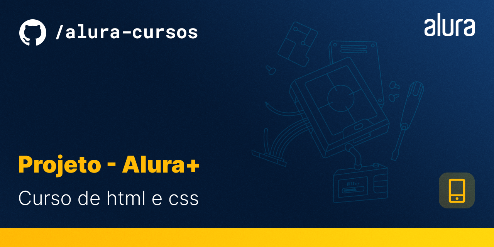

# Projeto - ALura+

# Resumo do projeto

`` Projeto da pagina inicial de uma plataforma de streaming, a Alura+, começei a colocar alguns estilos referentes a responsividade. Foco deste projeto foi praticar o CSS e o HTML.``

# ✔️ Técnicas e tecnologias utilizadas

- ``HTML``
- ``CSS``

# 📁 Acesso ao projeto

Você pode acessar os arquivos do projeto clicando [aqui](https://github.com/mvergara94/projeto-alura-mais/find/main). E o link através do Github pages é [este](https://mvergara94.github.io/projeto-alura-mais/).

# Screenshot da tela inicial

